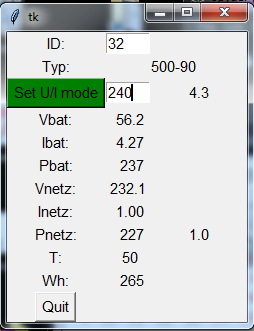

# AEConversion
For AEConversion Micro-Wechselrichter with RS485

Set the U/I mode for power limitation, and readout some parameters with a simple Python programm.

Tested with INV500-90 RS485.

Connect RS485:  
   - Pin A  -> CAT5(Pin 6) green.  
   - Pin B  -> CAT5(Pin 3) green/white.  
   
After start: 
  - ID input: 32  -> connect and give the typ 500-90.  
  - click Set U/I mode and enter require power.  
  
  
  
